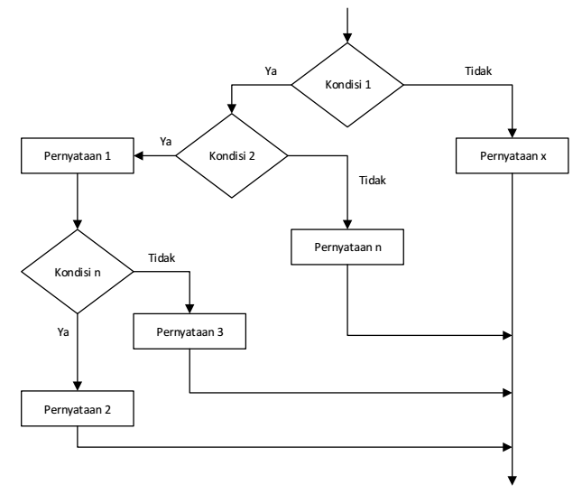
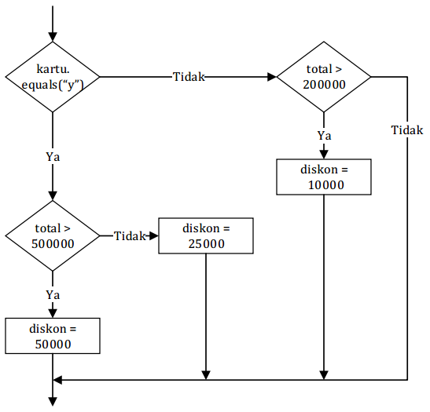
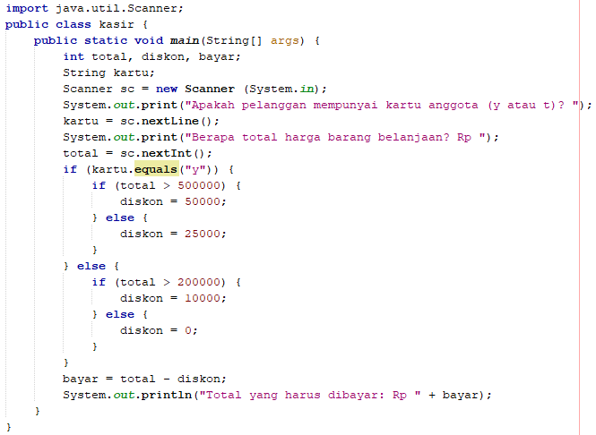
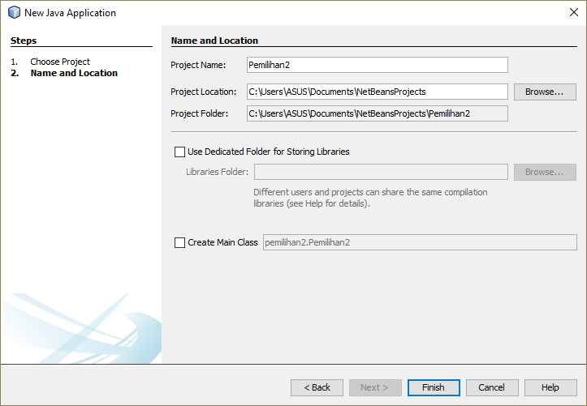
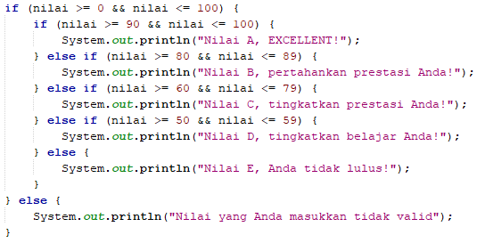
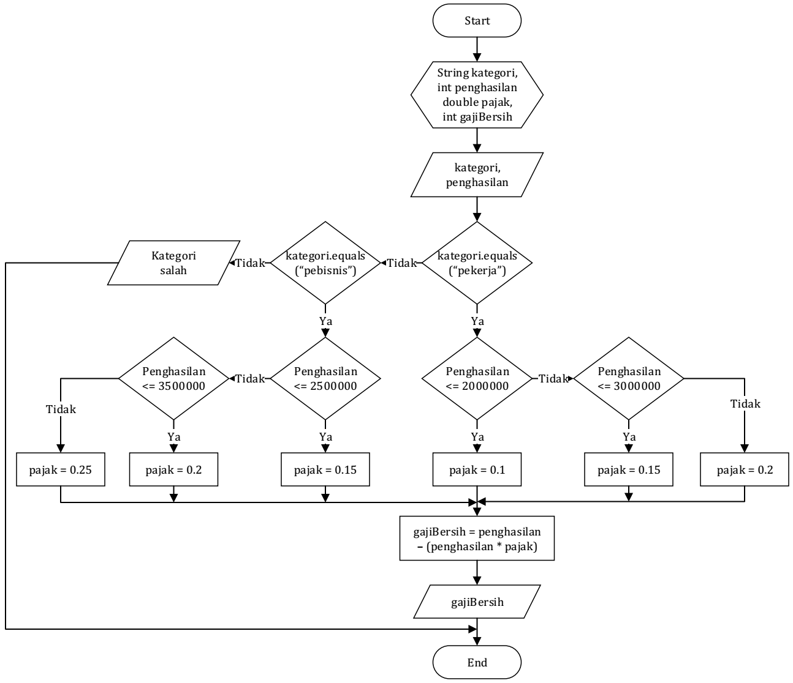
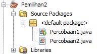
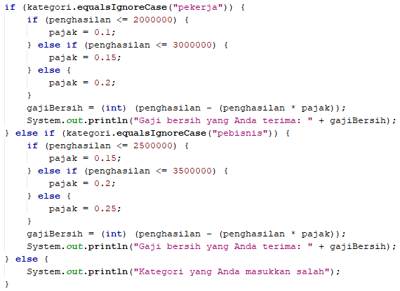
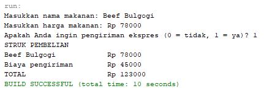
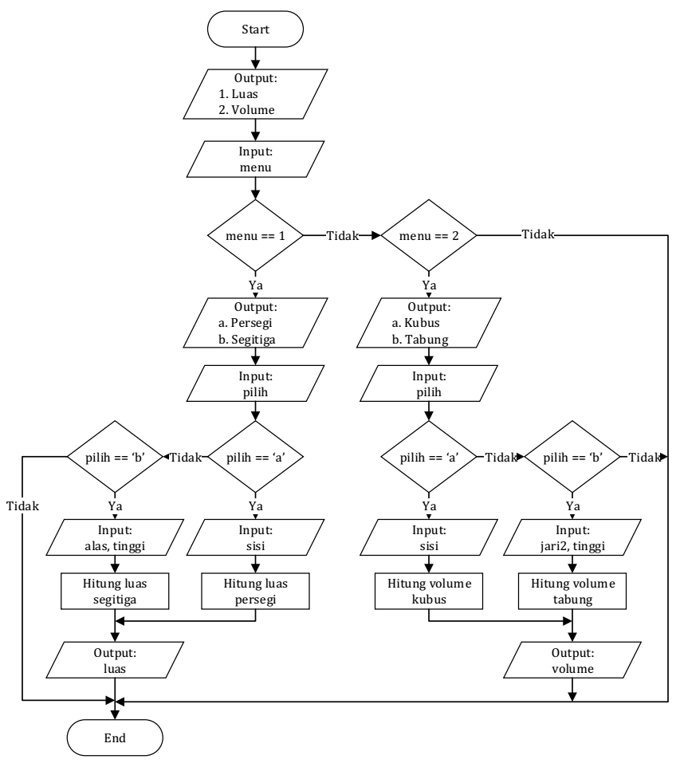

#  Sintaks Pemilihan 2

## Tujuan
- Mahasiswa memahami tentang operator logika
- Mahasiswa mampu menyelesaikan permasalahan dengan menggunakan sintaks pemilihan bersarang
- Mahasiswa mampu membuat sebuah program Java yang memanfaatkan sintaks pemilihan bersarang

## Alat dan Bahan

1. PC atau Laptop
2. NetBeans IDE

## Uraian Teori

Kita telah mempelajari penggunaan pernyataan IF untuk memilih sebuah tidak,
pernyataan IF-ELSE untuk memilih antara dua tindakan, serta pernyataan IF-ELSE
IF-ELSE dan SWITCH-CASE untuk memilih beberapa tindakan (3 atau lebih).
Terkadang kita membutuhkan pengambilan keputusan dalam bentuk level (bertingkat)
sehingga di dalam suatu pernyataan IF (atau IF-ELSE) bisa saja terdapat
pernyataan IF (atau IF-ELSE) yang lain. Jenis percabangan seperti ini disebut
NESTED IF (percabangan bersarang).  Secara umum, bentuk penulisan pernyataan
NESTED IF adalah sebagai berikut:

```java
if (kondisi 1){
  if (kondisi 2){
    pernyataan 1;
    …
    …
    if (kondisi n){
      pernyataan 2;
    } else {
      pernyataan 3;
    }
	} else {
    pernyataan n;
	}
} else {
  pernyataan x;
}
```


Pada bentuk penulisan pernyataan NESTED-IF tersebut, kondisi yang akan diseleksi
pertama kali adalah kondisi IF yang berada di posisi terluar (kondisi 1).

  - Jika kondisi 1 bernilai salah, maka pernyataan ELSE terluar (pasangan dari
   IF yang bersangkutan) yang akan diproses. Namun, jika pernyataan ELSE
   (pasangan dari IF) tidak ditulis, maka penyeleksian kondisi akan dihentikan.

  - Jika ternyata kondisi 1 bernilai benar, maka kondisi berikutnya yang lebih
   dalam (kondisi 2) akan diseleksi. Jika kondisi 2 bernilai salah, maka
   pernyataan ELSE (pasangan dari IF yang bersangkutan) yang akan diproses.
   Namun, jika pernyataan ELSE (pasangan dari IF) tidak ditulis, maka
   penyeleksian kondisi akan dihentikan.

Dengan cara yang sama, penyeleksian kondisi akan dilakukan sampai dengan kondisi
n, jika kondisi-kondisi sebelumnya bernilai benar. Flowchart sintaks pemilihan
bersarang ditunjukkan pada Gambar 1.



Gambar 1. Flowchart Sintaks Pemilihan Bersarang

Berikut ini adalah contoh penggunaan NESTED IF ketika seseorang akan melakukan pembayaran di kasir. Kasir akan memberikan pertanyaan sebagai berikut:

- Apakah pelanggan mempunyai kartu anggota?
  - TRUE: Pelanggan mempunyai kartu anggota
    - Apakah total harga barang belanjaan lebih dari Rp 500.000?
      - TRUE: Total harga barang belanjaan lebih dari Rp 500.000,
        pelanggan mendapatkan diskon Rp 50.000
      - FALSE: Total harga barang belanjaan tidak lebih dari Rp 500.000,
        pelanggan mendapatkan diskon Rp 25.000
  - FALSE: Pelanggan tidak mempunyai kartu anggota
    - Apakah total harga barang belanjaan lebih dari Rp 200.000?
      - TRUE: Total harga barang belanjaan lebih dari Rp 200.000,
        pelanggan mendapatkan diskon Rp 10.000
      - FALSE: Total harga barang belanjaan tidak lebih dari Rp 200.000,
        pelanggan tidak mendapatkan diskon

Untuk lebih memperjelas alur percabangan pada contoh kasus tersebut, perhatikan
flowchart pada Gambar 2.



Gambar 2. Contoh Flowchart

Gambar 3 menunjukkan kode program untuk penggunaan NESTED IF pada contoh kasus
pembayaran di kasir.



Gambar 3. Contoh Kode Program

Pada kode program tersebut, kasir diminta untuk memasukkan input, apakah
pelanggan mempunyai kartu anggota atau tidak. Selanjutnya kasir juga perlu
memasukkan total harga barang belanjaan. Kondisi yang akan diseleksi pertama
kali adalah nilai dari variabel “kartu”. Jika pengguna memasukkan input “y”,
maka seleksi kondisi ini bernilai benar, dan selanjutnya dilakukan penyeleksian
total harga barang belanjaan untuk menentukan diskon yang diperoleh. Gambar 4
menunjukkan hasil keluaran program ketika dijalankan.


Gambar 4. Contoh Hasil Keluaran Program

Kondisi di dalam pernyataan IF-ELSE dapat berupa ekspresi boolean yang kompleks,
dimana operator logika seperti `&&`, `||`, dan `!` dapat digunakan. Operator yang
diterapkan pada sub-ekspresi akan dievaluasi dari kiri ke kanan.

- Ketika mengevaluasi (`e1 && e2`), jika `e1` menghasilkan FALSE, maka `e2` tidak akan
 dievaluasi. Dengan demikian, nilai seluruh ekspresi (`e1 && e2`) akan dianggap
 salah. Namun, jika `e1` menghasilkan TRUE, maka selanjutnya `e2` akan
 dievaluasi untuk menentukan nilai seluruh ekspresi

- Ketika mengevaluasi (e1 || e2), jika e1 menghasilkan TRUE, maka e2 tidak
  akan dievaluasi. Dengan demikian, nilai seluruh ekspresi (e1 || e2) akan
  dianggap benar. Namun, jika e1 menghasilkan FALSE, maka selanjutnya e2
  akan dievaluasi untuk menentukan nilai seluruh ekspresi

## Praktikum
### Percobaan 1
1. Jalankan NetBeans
2. Buat project baru dengan cara klik menu File  New Project. Pada panel
   Categories, pilih Java Application  klik Next. Masukkan Pemilihan2 pada
   Project Name, hilangkan tanda centang (uncheck) pilihan Create Main Class 
   klik Finish

   

3. Buat file java dengan cara klik kanan pada Sources Packages -> New -> Java
   Class. Masukkan nama Percobaan1 pada nama class, kemudian klik Finish.

   

      File Percobaan1.java akan ditambahkan pada project Pemilihan2 dan class
      Percobaan1 akan terbuka pada text Editor

4. Tambahkan import library Scanner
5. Tuliskan struktur dasar bahasa Java yang berisi fungsi main()
6. Deklarasikan Scanner dengan nama sc
7. Buatlah variabel bertipe int dengan nama nilai
8. Tambahkan kode berikut ini untuk menerima input dari keyboard

    

9. Buatlah struktur pengecekan kondisi bersarang. Pengecekan pertama digunakan
   untuk memastikan bahwa nilai yang dimasukkan berada pada rentang 0 – 100.
   Jika nilai berada pada rentang 0 – 100, maka akan dilakukan pengecekan status
   kelulusan mahasiswa, yaitu jika nilai di antara 90 – 100 maka nilainya A,
   jika nilai di antara 80 – 89 maka nilainya B, jika nilai di antara 60 – 79
   maka nilainya C, jika nilai di antara 50 – 59 maka nilainya D, dan jika nilai
   di antara 0 – 49 maka nilainya E. Sedangkan jika nilai berada di luar rentang
   0 – 100, maka ditampilkan informasi bahwa nilai yang dimasukkan tidak valid.

   

10. Jalankan program tersebut. Amati apa yang terjadi!

### Pertanyaan

1. Jelaskan fungsi sintaks `if (nilai >= 0 && nilai <= 100)` !
2. Modifikasi kode program pada Percobaan 1 sehingga jika nilai yang dimasukkan
   kurang dari 0 akan ditampilkan output “Nilai yang Anda masukkan kurang dari
   0” dan jika nilai yang dimasukkan lebih dari 100 akan ditampilkan output
   “Nilai yang Anda masukkan lebih dari 100”!
3. Ubah operator `&&` menjadi `||` pada sintaks `if (nilai >= 0 && nilai <= 100)`.
   Jalankan program dengan memasukkan nilai = 105. Amati apa yang terjadi!
   Mengapa hasilnya demikian?

### Percobaan 2

1. Perhatikan flowchart berikut ini!

      
    
      Flowchart tersebut digunakan untuk menghitung gaji bersih seseorang setelah
      dipotong pajak sesuai dengan kategorinya (pekerja dan pebisnis) dan besarnya
      penghasilan.

2. Jalankan NetBeans
3. Pada project Pemilihan2, buat file java dengan cara klik kanan pada Sources
   Packages -> New -> Java Class. Masukkan nama Percobaan2 pada nama class,
   kemudian klik Finish.

      
    
      File Percobaan2.java akan ditambahkan pada project Pemilihan2 dan class
      Percobaan2 akan terbuka pada text Editor

4. Tambahkan import library Scanner
5. Tuliskan struktur dasar bahasa Java yang berisi fungsi main()
6. Deklarasikan Scanner dengan nama sc
7. Deklarasikan variabel kategori, penghasilan, gajiBersih, dan pajak;

    

8. Tambahkan kode berikut ini untuk menerima input dari keyboard

    

9. Buatlah struktur pengecekan kondisi bersarang. Pengecekan pertama digunakan
   untuk mengecek kategori (pekerja atau pebisnis). Selanjutnya dilakukan
   pengecekan kedua untuk menentukan besarnya pajak berdasarkan penghasilan yang
   telah dimasukkan. Kemudian tambahkan kode program untuk menghitung gaji
   bersih yang diterima setelah dipotong pajak

   

10. Jalankan program tersebut. Amati apa yang terjadi!

### Pertanyaan

1. Jalankan program dengan memasukkan `kategori = pekerja` dan `penghasilan =
   2048485`. Amati apa yang terjadi! Mengapa angka di belakang koma tidak
   ditampilkan?
2. Jelaskan fungsi dari `(int)` pada sintaks `gajiBersih = (int) (penghasilan -
   (penghasilan * pajak));`
3. Jalankan program dengan memasukkan `kategori = PEBISNIS` dan penghasilan =
   2000000. Amati apa yang terjadi! Apa kegunaan dari equalsIgnoreCase?
4. Ubah `equalsIgnoreCase` menjadi `equals`, kemudian jalankan program dengan
   memasukkan kategori = PEBISNIS dan penghasilan = 2000000. Amati apa yang
   terjadi! Mengapa hasilnya demikian? Apa kegunaan dari equals?
5. Modifikasi kode program pada Percobaan 2 sehingga jika penghasilan yang
   dimasukkan 0 atau kurang dari 0, maka terdapat informasi yang menyatakan
   bahwa penghasilan yang dimasukkan tidak valid!


## Tugas

1. Dengan menggunakan tiga nilai yang mewakili panjang tiga sisi sebuah
   segitiga, tentukan apakah segitiga tersebut sama sisi (ketiga sisinya
   bernilai sama), sama kaki (kedua sisinya bernilai sama), atau sembarang
   (tidak ada sisi yang bernilai sama)!

2. Buat program login yang mensyaratkan username dan password harus benar untuk
   bisa masuk ke dalam sistem. Terdapat dua buah kondisi, kondisi pertama untuk
   menguji apakah username valid, dan kondisi kedua untuk menguji apakah
   password benar. Pengguna diminta untuk memasukkan username terlebih dahulu,
   jika ternyata username salah, maka program berhenti dan menampilkan pesan
   bahwa username tidak ditemukan (pengguna tidak perlu diminta memasukkan
   password jika username salah). Jika username benar, maka pengguna diminta
   untuk memasukkan password. Jika password yang dimasukkan benar, maka terdapat
   pesan yang menyatakan bahwa pengguna berhasil login. Namun, jika password
   salah, maka terdapat pesan yang menyatakan bahwa password salah.

      > Catatan:                                                                                                                                                                                                                                                                                                                                                                                                                                                                                                                                                                                                                                                                                                                                                                                          >
      > username: Mahasiswa (MAHAsiswa dianggap sama)
      >- password: RaHaSia (RAHASIA dianggap tidak sama)

   Contoh hasil keluaran program:

   
   
   

3. Restoran MakanYUK meminta Anda membuat sebuah program untuk menerima pesanan
  dari internet. Program yang Anda buat meminta pengguna untuk memasukkan nama
  makanan dan harga. Setelah itu, pengguna ditawarkan untuk menggunakan
  pengiriman ekspres. Jika pengguna menolak, maka jenis pengiriman yang
  digunakan adalah pengiriman reguler. Biaya pengiriman reguler untuk harga
  makanan kurang dari Rp 100.000 adalah Rp 20.000, sedangkan untuk harga
  makanan sama dengan atau lebih dari Rp 100.000 biaya pengirimannya adalah Rp
  30.000. Untuk jenis pengiriman ekspres, tambahkan biaya tambahan sebesar Rp
  25.000 dari standar biaya pengiriman reguler. Tampilkan struk yang berisi
  nama makanan yang dibeli + harga, biaya pengiriman, dan total yang harus
  dibayar!

    Contoh hasil keluaran program:

    
    

4. Perhatikan flowchart berikut ini!

  

  Buat program sesuai dengan flowchart tersebut!
